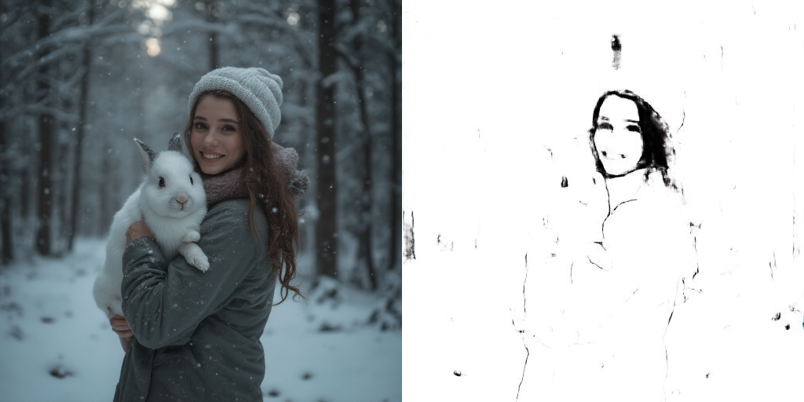

# GAN Pix2Pix

This repository contains the first model I have trained.

---

## Background

I had a photo of my grandparents and wanted to create a drawing of them to engrave on wood using a laser. After taking UDEMY courses on GANs, I thought this might be feasible.

Since I had no dataset for image-to-drawing conversion, I rendered more or less photorealistic animations using a 3D engine and applied a shader that resembled a drawing. I then trained models based on [this tutorial](https://learnopencv.com/paired-image-to-image-translation-pix2pix/).

However, the results were not satisfactory, and I saw little hope of significantly improving them. The data quality could still be enhanced, but generating the dataset and training the model would require too much time.

In the end, I had the photo hand-drawn by an artist and then used it for the wood laser engravings. The test image generated by the model at least shows that the neural network was heading in the right direction.



---

## Training

PyTorch was used for training.

For using NVIDIA CUDA 12.6: `pip3 install torch torchvision torchaudio --index-url https://download.pytorch.org/whl/cu126`

---

## Usage

The script `convert.py` converts an image from the test folder (`test/val/matrix`) and saves it as `test/result/sample_generated.jpg`.
The Model `generator_epoch_9` will be used.

---

## Preparation

### Install Dependencies

Run the following command to install the required Python packages:
```bash
pip install -r requirements.txt
```

---

## Legal Information

- This tool uses PyTorch, OpenCV, etc. Refer to their respective licenses for compliance.
- Ensure your use case complies with data protection regulations, particularly when handling sensitive or personal information.
- The authors provide no warranty and assume no liability for any issues arising from the use of this tool.

---